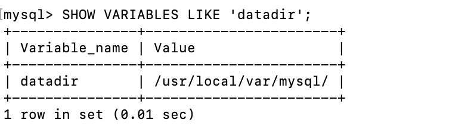
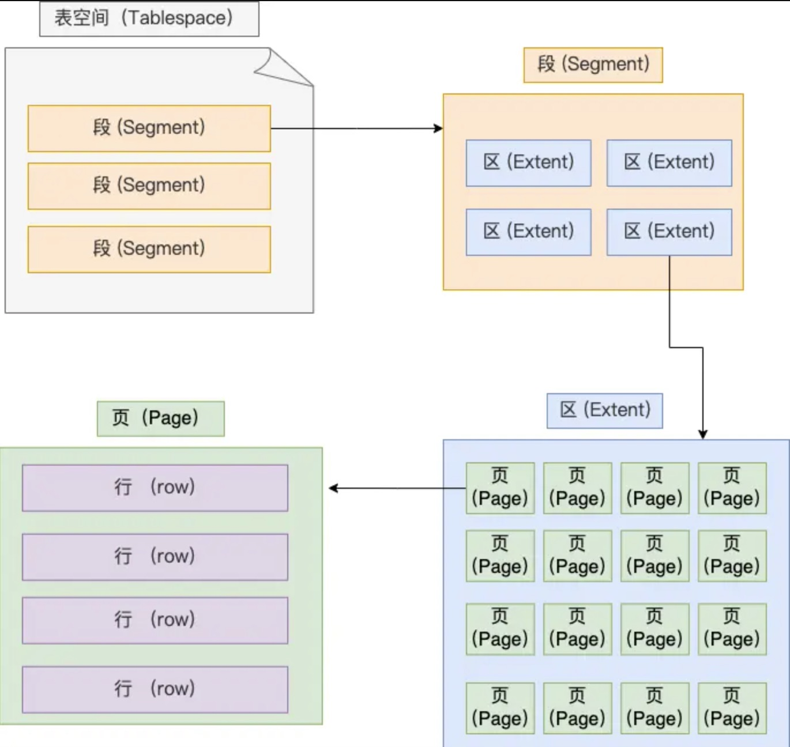
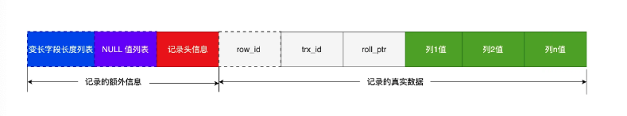

mysql架构分为两层：server层和存储引擎层，server层主要负责建立连接、分析和执行sql。主要包括连接器、查缓存。解析器、预处理器、优化器、执行器等。存储引擎层负责数据的存取。
### mysql的执行流程
1. 连接器
```
mysql -u$user -p 来连接mysql服务，连接的过程先经过TCP三次握手，mysql基于TCP协议进行传输。
show processlist 来查看服务有多少的客户连接，mysql空闲连接最大时长由wait_timeout参数控制，默认八小时。
mysql的链接也有长连接和短连接的概念：
// 短连接
连接 mysql 服务（TCP 三次握手）
执行sql
断开 mysql 服务（TCP 四次挥手）

// 长连接
连接 mysql 服务（TCP 三次握手）
执行sql
执行sql
执行sql
....
断开 mysql 服务（TCP 四次挥手）

长连接会更多的占用内存，一般有两种解决方式：
1.定期断开长连接
2.客户端主动重置连接，调用mysql_reset_connection
```
2.查询缓存
```
客户端向服务端发送了sql语句，服务端会解析sql语句的第一个字段，看是什么类型的语句。如果是select语句就会去查询缓存，在缓存里查找看之前是否
执行过这一条命令，这个查询缓存是以 key-value 形式保存在内存中的，key 为 sql 查询语句，value 为 sql 语句查询的结果。但对于更新比较频
繁的表，查询缓存的命中率是比较低的，因为只要表有更新，这个表的查询缓存就会被清空。
```
3.解析sql
```
1.词法解析，根据你输入的字符串识别出关键字，构建sql语法树
2.语法分析，根据词法分析的结果，语法解析器会根据语法规则，判断你输入的sql语句是否满足mysql语法。
```
4.执行sql
```
prepare 阶段，也就是预处理阶段；检查表和表中的字段是否存在。
optimize 阶段，也就是优化阶段；优化器主要负责将 SQL 查询语句的执行方案确定下来，比如在表里面有多个索引的时候，优化器会基于查询成本的考虑，
来决定选择使用哪个索引。
execute 阶段，也就是执行阶段；确定好执行方案，执行器就会和存储引擎交互。

```
### mysql如何存储一条记录

```
 我们每创建一个database都会在/var/lib/mysql 目录里创建一个以database为名的目录，然后保存表结构和表数据的文件都会存放在这个目录里。
```
#### 表空间文件结构是怎么样的？
```
表空间由段（segment）、区（extent）、页（page）、行（row）组成，InnoDB存储引擎的逻辑存储结构大致如下图
```

```
1、行（row）
数据库表中的记录都是按行（row）进行存放的，每行记录根据不同的行格式，有不同的存储结构。
后面我们详细介绍 InnoDB 存储引擎的行格式，也是本文重点介绍的内容。

2、页（page）
记录是按照行来存储的，但是数据库的读取并不以「行」为单位，否则一次读取（也就是一次 I/O 操作）只能处理一行数据，效率会非常低。
因此，InnoDB 的数据是按「页」为单位来读写的，也就是说，当需要读一条记录的时候，并不是将这个行记录从磁盘读出来，而是以页为单位，将其整体读入内存。
默认每个页的大小为 16KB，也就是最多能保证 16KB 的连续存储空间。
页是 InnoDB 存储引擎磁盘管理的最小单元，意味着数据库每次读写都是以 16KB 为单位的，一次最少从磁盘中读取 16K 的内容到内存中，一次最少把内存中的 16K 内容刷新到磁盘中。
页的类型有很多，常见的有数据页、undo 日志页、溢出页等等。数据表中的行记录是用「数据页」来管理的。

3、区（extent）
我们知道 InnoDB 存储引擎是用 B+ 树来组织数据的。
B+ 树中每一层都是通过双向链表连接起来的，如果是以页为单位来分配存储空间，那么链表中相邻的两个页之间的物理位置并不是连续的，可能离得非常远，那么磁盘查询时就会有大量的随机I/O，随机 I/O 是非常慢的。
解决这个问题也很简单，就是让链表中相邻的页的物理位置也相邻，这样就可以使用顺序 I/O 了，那么在范围查询（扫描叶子节点）的时候性能就会很高。
那具体怎么解决呢？
在表中数据量大的时候，为某个索引分配空间的时候就不再按照页为单位分配了，而是按照区（extent）为单位分配。每个区的大小为 1MB，对于 16KB 的页来说，连续的 64 个页会被划为一个区，这样就使得链表中相邻的页的物理位置也相邻，就能使用顺序 I/O 了。

4、段（segment）
表空间是由各个段（segment）组成的，段是由多个区（extent）组成的。段一般分为数据段、索引段和回滚段等。
索引段：存放 B + 树的非叶子节点的区的集合；
数据段：存放 B + 树的叶子节点的区的集合；
回滚段：存放的是回滚数据的区的集合，之前讲事务隔离 (opens new window)的时候就介绍到了 MVCC 利用了回滚段实现了多版本查询数据。
```
### innoDB的行格式
InnoDB 提供了 4 种行格式，分别是 Redundant、Compact、Dynamic和 Compressed 行格式。  
Compact 是一种紧凑的行格式，设计的初衷就是为了让一个数据页中可以存放更多的行记录，从 MySQL 5.1 版本之后，行格式默认设置成 Compact。  
### COMPACT行格式 


一条完整的行记录包括记录的额外信息和记录的真实信息  
 - 记录的额外信息  
记录的额外信息包括变长字段长度列表、null值列表、记录头信息