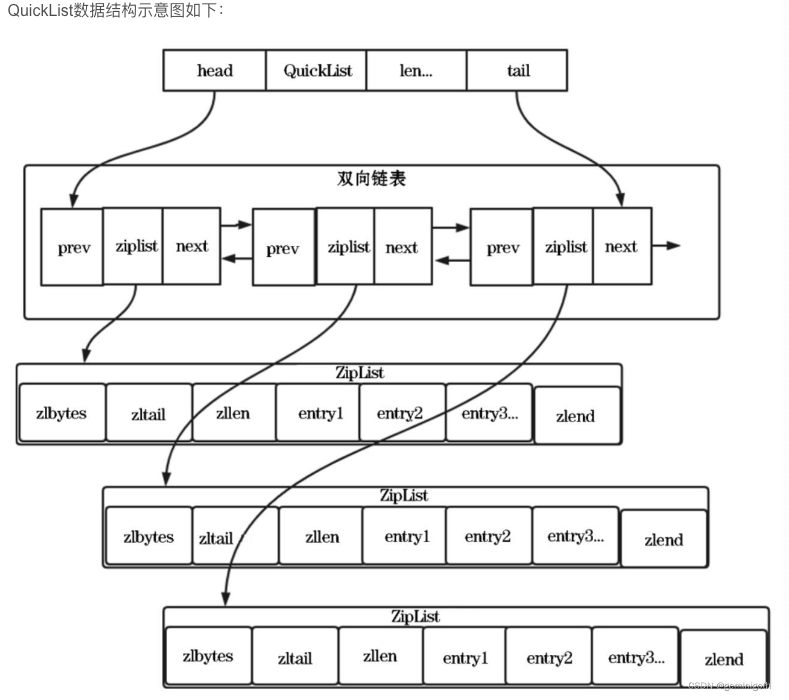

## List 
___
List是简单的字符串列表，可从头部或尾部插入元素。每个列表支持超过40亿个元素。
### 内部实现
List 类型的底层数据结构是由快速链表实现的
- quickList
    quickList 是ZipList和LinkedList的混合体,它将linkedList按段切分，每⼀段使⽤zipList来紧凑存储，多个zipList之间使⽤双向指针串接起来。  

``` 
typedef struct quicklist {
    //指向头结点的指针
    quicklistNode *head;
    //指向尾节点的指针
    quicklistNode *tail;
    //所有ZipList数据项的总项数
    unsigned long count;  
    //quickList节点的个数
    unsigned long len;    
    //16bit，用于设置ZipList的大小，存放list-max-ziplist-depth参数的值
    int fill : QL_FILL_BITS;     
    //16bit，用于设置节点压缩的深度，存放list-compress-depth参数的值
    unsigned int compress : QL_COMP_BITS; /* depth of end nodes not to compress;0=off */
    unsigned int bookmark_count: QL_BM_BITS;
    quicklistBookmark bookmarks[];
} quicklist

typedef struct quicklistNode {
    //上一个node节点
    struct quicklistNode *prev;
    //下一个node节点
    struct quicklistNode *next;
    unsigned char *zl;
    unsigned int sz;             /* ziplist size in bytes */
    unsigned int count : 16;     /* count of items in ziplist */
    unsigned int encoding : 2;   /* RAW==1 or LZF==2 */
    unsigned int container : 2;  /* NONE==1 or ZIPLIST==2 */
    unsigned int recompress : 1; /* was this node previous compressed? */
    unsigned int attempted_compress : 1; /* node can't compress; too small */
    unsigned int extra : 10; /* more bits to steal for future usage */
} quicklistNode;

typedef struct quicklistLZF {
    //表示压缩后所占用的字节数
    unsigned int sz;
    //一个柔性数组，存放压缩后的ZipList字节数组
    char compressed[];
} quicklistLZF;
```
### 常用命令
```
# 将一个或多个value值插入到key列表的表头。
LPUSH key value [value ...]

# 将一个或多个value值插入到key列表的表尾。
RPUSH key value [value ...]

# 移除并返回key列表的头元素
LPOP key     

# 移除并返回key列表的尾元素
RPOP key

# 返回列表key中指定区间内的元素
LRANGE key start stop

# 从key列表表头/表尾弹出一个元素，没有就阻塞timeout秒
BLPOP key [key ...] timeou
BRPOP key [key ...] timeou
```
### 应用场景
消息队列  
消息队列在存取消息时，必须满足三个需求，分别是消息保序、处理重复消息、保证消息可靠性。  
1. 消息保序  
list本身就是按照先进先出的顺序存取消息的，list可以使用lpush和rpop实现消息队列。
 - 生产者使用LPUSH key value 将消息放入消息队列头部
 - 消费者使用RPOP key 以此取出队列消息。但消费者读取数据时需要不断调用RPOP来取消息，会带来不必要的性能损失，但可以使用BRPOP(阻塞式读)，客户端在没有读取到队列消息时，自动阻塞，有新数据进来时，在读新数据。  
2. 如何处理重复消息  
处理重复消息首先得满足2点
 - 每个消息都有一个唯一id
 - 消费者记录自己已经处理过的消息的id
3. 如何保证消息的可靠性  
   如果消费者程序在处理消息的过程出现了故障或宕机，就会导致消息没有处理完成，那么，消费者程序再次启动后，就没法再次从 List 中读取消息了。List 类型提供了 BRPOPLPUSH 命令，这个命令的作用是让消费者程序从一个 List 中读取消息，同时，Redis 会把这个消息再插入到另一个 List（可以叫作备份 List）留存。  

list作为消息队列还有缺陷：不支持多个消费者消费同一条消息、不支持实现消费组。